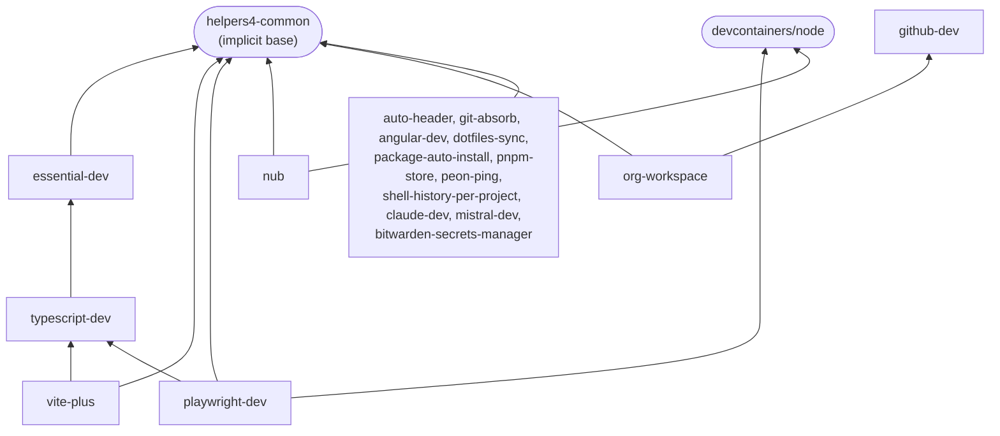

<h1 align="center">helpers4 — DevContainer Features</h1>

<p align="center">
  <strong>Production-ready DevContainer Features for instant, reproducible development environments.</strong>
</p>

<p align="center">
  <a href="https://github.com/helpers4/devcontainer/blob/main/LICENSE"></a>
  <a href="https://github.com/helpers4/devcontainer"></a>
  <a href="https://containers.dev/features"></a>
  <a href="https://deepwiki.com/helpers4/devcontainer"></a>
  <a href="https://securityscorecards.dev/viewer/?uri=github.com/helpers4/devcontainer"></a>
</p>

---

## Overview

This repository contains a collection of DevContainer Features developed and maintained by the helpers4 organization. All features are published to the GitHub Container Registry and can be referenced directly in any `devcontainer.json`.

```
ghcr.io/helpers4/devcontainer/<feature-name>
```

## Features

### helpers4-common

Shared bootstrap library every other feature in this repo depends on: a `common.sh` script for user/home detection and apt helpers, plus an automatic git-config self-heal that runs on every attach. This is an internal dependency, not something you add to `devcontainer.json` yourself — it comes along for free with any other helpers4 feature.

**Key benefits:**
- Repairs broken `credential.helper`/`gpg.program` paths and a missing SSH commit-signing key on every attach, on local and cloud containers alike
- Nothing to configure — it activates automatically as soon as one helpers4 feature is present
- A single shared `common.sh` instead of every feature carrying its own copy of user-detection logic

[📖 Documentation](./src/helpers4-common/README.md)

### copilot-dev

GitHub Copilot Chat and the `gh copilot` CLI extension, plus shared instructions that steer Copilot's commit-message, PR-description, and code-review generation toward this org's conventions (Conventional Commits + gitmoji + PR template). Covers the AI assistant only — pair it with `github-dev` for `gh` CLI and the other GitHub platform extensions.

**Key benefits:**
- GitHub Copilot Chat pre-installed, `gh copilot explain`/`suggest` in the terminal
- Commit messages and PR descriptions generated to this org's Conventional Commits + gitmoji format automatically
- Code review instructions focused on correctness and security, not style nitpicks
- Every instruction is overridable or disableable per-repo

[📖 Documentation](./src/copilot-dev/README.md)

### claude-dev

Installs the Claude Code IDE extension across supported editors and persists `~/.claude` (credentials, config, memory) across every rebuild — including GitHub Codespaces — via a Docker named volume. Optionally installs the `claude` CLI too.

**Key benefits:**
- Credentials, config, and memory survive every rebuild, `--no-cache` included
- Shared per host OS user, not per container — no re-login after a rebuild
- Optional `claude` CLI alongside the IDE extension

[📖 Documentation](./src/claude-dev/README.md)

### mistral-dev

Installs the Mistral Vibe IDE extension across supported editors for AI-assisted coding powered by Mistral. Credentials and configuration persist in a Docker named volume, surviving every rebuild including Codespaces.

**Key benefits:**
- Credentials and configuration survive every rebuild, `--no-cache` and Codespaces included
- Shared per host OS user across containers
- Zero setup beyond adding the feature

[📖 Documentation](./src/mistral-dev/README.md)

### cline-dev

Installs the Cline AI coding agent extension for VS Code and Cursor, and optionally the `cline` CLI. Unlike `claude-dev`/`mistral-dev`, it persists no credentials of its own across rebuilds.

**Key benefits:**
- Cline extension pre-installed and ready to sign in
- Optional CLI install via `installCli`
- No named-volume persistence to manage — Cline handles its own auth

[📖 Documentation](./src/cline-dev/README.md)

### nub

Installs [nub](https://nubjs.com/), a single Rust binary that runs TypeScript/JavaScript files, `package.json` scripts, and local CLIs directly on the Node.js and package manager already in the container — no new runtime, no lock-in. Doesn't manage Node versions itself, so it never competes with the container's own version-selection mechanism.

**Key benefits:**
- Runs `.ts`/`.js` files and npm scripts without a separate runtime install
- Built on top of whatever Node + package manager the container already has
- Pairs with `package-auto-install` (`packageManager: "nub"`) for one-line setup

[📖 Documentation](./src/nub/README.md)

### vite-plus

Complete Vite+ toolchain setup with VS Code extensions (Oxc, Vitest), optimized configuration, and optional global CLI tools. Perfect for modern web development with React, Vue, Svelte, and more.

**Key benefits:**
- Pre-configured Oxc formatter/linter (100x faster than ESLint)
- Vitest test explorer integration
- Smart defaults for Vite+ development
- Global Oxc CLI installation option
- Project setup helper command
- Supports all Vite-compatible frameworks

[📖 Documentation](./src/vite-plus/README.md)

### playwright-dev

OS-level dependencies for headless Chromium, Firefox, and WebKit, a browser-binary cache shared across rebuilds via a Docker named volume, and the official Playwright Test VS Code extension.

**Key benefits:**
- OS packages installed once via the official `playwright install-deps` (no hand-maintained apt list)
- Browser binaries cached in a Docker volume — no re-download on every rebuild
- Official Playwright Test VS Code extension, pre-configured
- Doesn't install the `playwright` npm package itself — stays in sync with your project's own version
- Enables Chromium's CDP `WebAuthn.addVirtualAuthenticator` for passkey/WebAuthn testing without hardware

[📖 Documentation](./src/playwright-dev/README.md)

### package-auto-install

Automatically detects and runs npm/yarn/pnpm install in non-interactive mode after container creation. Handles corepack setup for Node 24+ and intelligently detects the package manager from package.json or lockfiles.

**Key benefits:**
- Automatic package manager detection from package.json or lockfiles
- Corepack support for Node 24+ (auto-installs if needed)
- Non-interactive mode (CI=true) prevents prompts
- Smart command selection (npm ci, pnpm --frozen-lockfile, yarn --immutable)
- Eliminates need for manual postCreateCommand

[📖 Documentation](./src/package-auto-install/README.md)

### pnpm-store

Configures a shared pnpm content-addressable store on the **same filesystem as your code**, so pnpm's hardlinks work and no stray `.pnpm-store` folders pollute your repos. A safer alternative to Docker-volume-based store sharing, which breaks hardlinking in bind-mounted workspaces.

**Key benefits:**
- Keeps the pnpm store on the same filesystem as bind-mounted repos
- No `.pnpm-store` clutter inside your projects
- Shares the store across every repo and across rebuilds
- Fail-fast cross-device guard with an actionable fix message
- Writes `store-dir` to `~/.npmrc`; works with any pnpm install

[📖 Documentation](./src/pnpm-store/README.md)

### angular-dev

Angular-specific development environment with VS Code extensions and CLI autocompletion.

**Key benefits:**
- Essential VS Code extensions for Angular development
- CLI autocompletion for zsh and bash
- Optional Angular CLI installation
- Ready-to-use Angular development setup

[📖 Documentation](./src/angular-dev/README.md)

### shell-history-per-project

Persist shell history per project by automatically detecting and configuring all available shells (zsh, bash, fish). Supports auto-detection or manual shell selection.

**Key benefits:**
- Per-project history isolation
- Persistent across container rebuilds
- Multiple shell support (zsh, bash, fish)
- Team collaboration friendly
- Clean separation between personal and project commands

[📖 Documentation](./src/shell-history-per-project/README.md)

### git-absorb

Installs git-absorb, a tool that automatically absorbs staged changes into their logical commits. Like 'git commit --fixup' but automatic.

**Key benefits:**
- Automatic fixup commits for staged changes
- Multi-architecture support (x86_64, aarch64)
- Git subcommand integration
- Lightweight single binary installation
- Perfect for cleaning up commit history

[📖 Documentation](./src/git-absorb/README.md)

### dotfiles-sync

Syncs local Git, SSH, GPG, and npm configuration files into the devcontainer. Works on macOS, Linux, Windows (WSL), and GitHub Codespaces. Uses a merge strategy — never overwrites existing values.

**Key benefits:**
- Git configuration, SSH keys, GPG keys, and npm auth synced automatically
- Merge strategy: safe to use alongside Codespaces native auth
- Environment-aware: detects macOS, Linux, WSL, and Codespaces
- SSH agent forwarding with runtime detection and fallback chain
- Successor to `local-mounts`

[📖 Documentation](./src/dotfiles-sync/README.md)

### local-mounts *(removed)*

> Replaced by `dotfiles-sync`. Use `ghcr.io/helpers4/devcontainer/dotfiles-sync:1` — options and behavior are fully compatible.

### essential-dev

Core development environment with Git visualization, Markdown support, and essential editor enhancements. For GitHub tooling (gh CLI, Copilot, PR & Issues), use `github-dev`.

**Key benefits:**
- Git history, graph visualization, and conventional commits support
- Complete Markdown support with preview and linting
- Multi-cursor, code comparison, and local file history
- File format support (YAML, JSON, CSV, XML, Makefile)
- Works out-of-the-box with zero configuration

[📖 Documentation](./src/essential-dev/README.md)

### github-dev

GitHub CLI (`gh`) and GitHub VS Code extensions (Copilot, Copilot Chat, Pull Requests & Issues, GitHub Actions, RemoteHub).

**Key benefits:**
- `gh` CLI for PRs, issues, releases, and Actions runs from the terminal
- Streamlined GitHub workflows in both the terminal and VS Code
- GitHub Copilot and Copilot Chat for AI assistance
- Pull Requests & Issues panel inside VS Code
- GitHub Actions workflow editor with validation
- RemoteHub to browse remote repos without cloning

[📖 Documentation](./src/github-dev/README.md)

### typescript-dev

TypeScript/JavaScript development setup with indexing, import management, HTML/CSS intelligence, and web tools. Built on top of `essential-dev` for core Git/editor enhancements, with Copilot and PR tooling provided by `github-dev`.

**Key benefits:**
- Latest TypeScript with indexing and import management
- HTML and CSS intelligence with auto-rename
- Automatic import/export management and path aliases
- Web development ready with code generation utilities
- Requires `essential-dev` for core tools

[📖 Documentation](./src/typescript-dev/README.md)

### auto-header

Automatically configures file headers with customizable templates based on project, license, company, and contributors information.

**Key benefits:**
- Two header styles: simple (3 lines) and custom (user-defined)
- Flexible configuration with project name, license, company, and contributors
- Helper script `h4-init-headers` for easy initialization
- SPDX compliant license identifiers
- Works in VS Code with zero configuration needed after setup
- Perfect for maintaining consistent file headers across team projects

[📖 Documentation](./src/auto-header/README.md)

### peon-ping

Installs [peon-ping](https://peonping.com/) for game character voice notifications when your AI coding agent finishes or needs permission. Includes the Peon Pet VS Code extension.

**Key benefits:**
- Sound notifications from 165+ packs (Warcraft, StarCraft, Portal, Zelda…)
- Multi-IDE hooks: Claude Code, Copilot, Cursor, Codex, and more
- Animated Peon Pet sidebar companion in VS Code
- Devcontainer-aware audio relay to host machine
- Non-interactive, idempotent installation

[📖 Documentation](./src/peon-ping/README.md)

### bitwarden-secrets-manager

Installs `bws`, the official Bitwarden Secrets Manager CLI, straight from Bitwarden's own GitHub releases. Scoped to non-interactive, machine-account-token auth only — no vault login, no persisted state, no host bind-mounts.

**Key benefits:**
- Token-only auth via `BWS_ACCESS_TOKEN` — no interactive login flow to script around
- Nothing persisted or bind-mounted; everything stays inside the container
- `bws` (Secrets Manager) only — not the `bw` vault CLI, which needs a different auth model

[📖 Documentation](./src/bitwarden-secrets-manager/README.md)

### org-workspace

Clones every repo of a GitHub org into sibling `/workspaces` folders and generates or updates a multi-root `.code-workspace` file — add this to one "bootstrap" project instead of hand-writing `mounts` entries and a workspace file per project.

**Key benefits:**
- One feature reference brings in an entire org's worth of repos
- Clones persist across rebuilds via a named volume
- Auto-discovers the org from the bootstrap repo's own `origin` remote, or takes an explicit repo list

[📖 Documentation](./src/org-workspace/README.md)

## Usage

Features from this repository are available via GitHub Container Registry. Reference them in your `devcontainer.json`:

```json
{
    "features": {
        "ghcr.io/helpers4/devcontainer/essential-dev:1": {},
        "ghcr.io/helpers4/devcontainer/github-dev:1": {},
        "ghcr.io/helpers4/devcontainer/vite-plus:1": {},
        "ghcr.io/helpers4/devcontainer/playwright-dev:1": {},
        "ghcr.io/helpers4/devcontainer/package-auto-install:1": {},
        "ghcr.io/helpers4/devcontainer/pnpm-store:1": {},
        "ghcr.io/helpers4/devcontainer/typescript-dev:1": {},
        "ghcr.io/helpers4/devcontainer/auto-header:1": {
            "projectName": "my-project"
        },
        "ghcr.io/helpers4/devcontainer/angular-dev:1": {},
        "ghcr.io/helpers4/devcontainer/shell-history-per-project:1": {},
        "ghcr.io/helpers4/devcontainer/git-absorb:1": {},
        "ghcr.io/helpers4/devcontainer/dotfiles-sync:1": {},
        "ghcr.io/helpers4/devcontainer/peon-ping:1": {}
    }
}
```

## Available Features

| Feature | Description | Documentation |
|---------|-------------|---------------|
| [helpers4-common](./src/helpers4-common) | Internal dependency, not added directly — shared bootstrap + automatic git-config self-heal | [README](./src/helpers4-common/README.md) |
| [essential-dev](./src/essential-dev) | Core dev environment with Git visualization, editor tools, and Markdown | [README](./src/essential-dev/README.md) |
| [github-dev](./src/github-dev) | gh CLI, Copilot, PR & Issues, Actions, RemoteHub | [README](./src/github-dev/README.md) |
| [copilot-dev](./src/copilot-dev) | Copilot Chat + gh copilot CLI + shared commit/PR/review instructions | [README](./src/copilot-dev/README.md) |
| [claude-dev](./src/claude-dev) | Claude Code extension + CLI + persistent `~/.claude` across rebuilds | [README](./src/claude-dev/README.md) |
| [mistral-dev](./src/mistral-dev) | Mistral Vibe extension + persistent `~/.vibe` across rebuilds | [README](./src/mistral-dev/README.md) |
| [cline-dev](./src/cline-dev) | Cline AI coding agent extension + optional CLI | [README](./src/cline-dev/README.md) |
| [nub](./src/nub) | Fast TS/JS/script runner on top of the container's own Node + package manager | [README](./src/nub/README.md) |
| [auto-header](./src/auto-header) | Automatic file headers with customizable templates (simple or custom) | [README](./src/auto-header/README.md) |
| [vite-plus](./src/vite-plus) | Complete Vite+ toolchain with Oxc, Vitest, and VS Code integration | [README](./src/vite-plus/README.md) |
| [playwright-dev](./src/playwright-dev) | Playwright OS deps (Chromium/Firefox/WebKit) + shared browser-binary volume + VS Code extension | [README](./src/playwright-dev/README.md) |
| [package-auto-install](./src/package-auto-install) | Automatic package installation with corepack support for Node 24+ | [README](./src/package-auto-install/README.md) |
| [pnpm-store](./src/pnpm-store) | Shared pnpm store on the same filesystem as your code — no stray .pnpm-store in repos | [README](./src/pnpm-store/README.md) |
| [typescript-dev](./src/typescript-dev) | TypeScript/JavaScript dev with indexing and web tools (requires essential-dev) | [README](./src/typescript-dev/README.md) |
| [angular-dev](./src/angular-dev) | Angular development environment with extensions and CLI autocompletion | [README](./src/angular-dev/README.md) |
| [shell-history-per-project](./src/shell-history-per-project) | Per-project shell history persistence with multi-shell auto-detection | [README](./src/shell-history-per-project/README.md) |
| [git-absorb](./src/git-absorb) | Automatic absorption of staged changes into logical commits | [README](./src/git-absorb/README.md) |
| [dotfiles-sync](./src/dotfiles-sync) | Sync local Git, SSH, GPG, and npm config — works on macOS, Linux, WSL, Codespaces | [README](./src/dotfiles-sync/README.md) |
| [bitwarden-secrets-manager](./src/bitwarden-secrets-manager) | `bws` CLI from Bitwarden's own GitHub releases, token-only auth, no persisted state | [README](./src/bitwarden-secrets-manager/README.md) |
| [peon-ping](./src/peon-ping) | AI agent sound notifications with multi-IDE hooks and Peon Pet extension | [README](./src/peon-ping/README.md) |
| [org-workspace](./src/org-workspace) | Clone an entire GitHub org into sibling workspace folders with one feature | [README](./src/org-workspace/README.md) |

## Dependency Graph

[`helpers4-common`](./src/helpers4-common) is the shared foundation almost every feature here `dependsOn` — you never add it yourself, it just comes along. A handful of features chain further on top of each other:



`github-dev`, `copilot-dev`, and `cline-dev` have no `dependsOn` at all — they only install VS Code extensions and CLI tools, with no shared bootstrap logic to pull in.

## Ready-to-Copy Stacks

### Web dev

```jsonc
{
  "features": {
    "ghcr.io/helpers4/devcontainer/essential-dev:1": {},
    "ghcr.io/helpers4/devcontainer/typescript-dev:1": {},
    "ghcr.io/helpers4/devcontainer/vite-plus:1": {},
    "ghcr.io/helpers4/devcontainer/package-auto-install:1": {},
    "ghcr.io/helpers4/devcontainer/pnpm-store:1": {}
  }
}
```

### Web dev + E2E testing

Same as above, plus `playwright-dev` for browser automation:

```jsonc
{
  "features": {
    "ghcr.io/helpers4/devcontainer/essential-dev:1": {},
    "ghcr.io/helpers4/devcontainer/typescript-dev:1": {},
    "ghcr.io/helpers4/devcontainer/vite-plus:1": {},
    "ghcr.io/helpers4/devcontainer/package-auto-install:1": {},
    "ghcr.io/helpers4/devcontainer/pnpm-store:1": {},
    "ghcr.io/helpers4/devcontainer/playwright-dev:1": {}
  }
}
```

### AI pairing

`github-dev` for the `gh` CLI and PR/Issues tooling, `copilot-dev` and `claude-dev` for two AI assistants side by side, and `peon-ping` so you hear when either one finishes or needs input:

```jsonc
{
  "features": {
    "ghcr.io/helpers4/devcontainer/essential-dev:1": {},
    "ghcr.io/helpers4/devcontainer/github-dev:1": {},
    "ghcr.io/helpers4/devcontainer/copilot-dev:1": {},
    "ghcr.io/helpers4/devcontainer/claude-dev:1": {},
    "ghcr.io/helpers4/devcontainer/peon-ping:1": {}
  }
}
```

### Multi-repo org bootstrap

This org's own `.dev` repo hand-writes a `mounts` entry per sibling repo to bring `.github`, `action`, `devcontainer`, `typescript`, and `website` into one workspace. [`org-workspace`](./src/org-workspace) replaces that with one feature reference — point it at the org and it clones every repo and generates the multi-root `.code-workspace` file for you:

```jsonc
{
  "features": {
    "ghcr.io/helpers4/devcontainer/github-dev:1": {},
    "ghcr.io/helpers4/devcontainer/org-workspace:1": {
      "autoDiscover": "public"
    }
  }
}
```

## Documentation

Full documentation is available at [**helpers4.dev/devcontainer**](https://helpers4.dev/devcontainer).

## Development

This repository follows the [DevContainer Features specification](https://containers.dev/implementors/features/) and is compatible with the [DevContainer Features distribution](https://containers.dev/implementors/features-distribution/).

### Testing

Features can be tested locally using the [DevContainer CLI](https://github.com/devcontainers/cli):

```bash
devcontainer features test --features shell-history-per-project
```

That installs the CLI on your host. To have it available **inside** a devcontainer instead —
useful for testing this repo's own features without a Node.js install on the host, or for
building/running a nested devcontainer — add the community
[`ghcr.io/devcontainers-extra/features/devcontainers-cli`](https://github.com/devcontainers-extra/features/tree/main/src/devcontainers-cli)
feature. It already does exactly this (a thin wrapper around `npm install -g @devcontainers/cli`),
so this repo doesn't duplicate it with a feature of its own:

```jsonc
{
  "features": {
    "ghcr.io/devcontainers-extra/features/devcontainers-cli:1": {}
  }
}
```

### Publishing

Features are automatically published to GitHub Container Registry via GitHub Actions when tagged releases are created.

## Contributing

Contributions are welcome! Please follow the established feature structure and test your changes locally before submitting.

1. Fork the repository
2. Create a feature branch
3. Add your feature following the established patterns
4. Test your feature locally
5. Submit a pull request

## License

This project is licensed under the [GNU Lesser General Public License v3.0](LICENSE).

## Acknowledgments

Inspired by the official [DevContainers Features](https://github.com/devcontainers/features) repository and [Stuart Leeks' dev-container-features](https://github.com/stuartleeks/dev-container-features) for the shell-history concept — with the key difference being project-scoped rather than global user history persistence.

## Contributors

<table>
<tr>
    <td align="center" style="word-wrap: break-word; width: 150.0; height: 150.0">
        <a href="https://github.com/baxyz">
            
            <br />
            <sub style="font-size:14px"><b>Bérenger</b></sub>
        </a>
    </td>
</tr>
</table>
